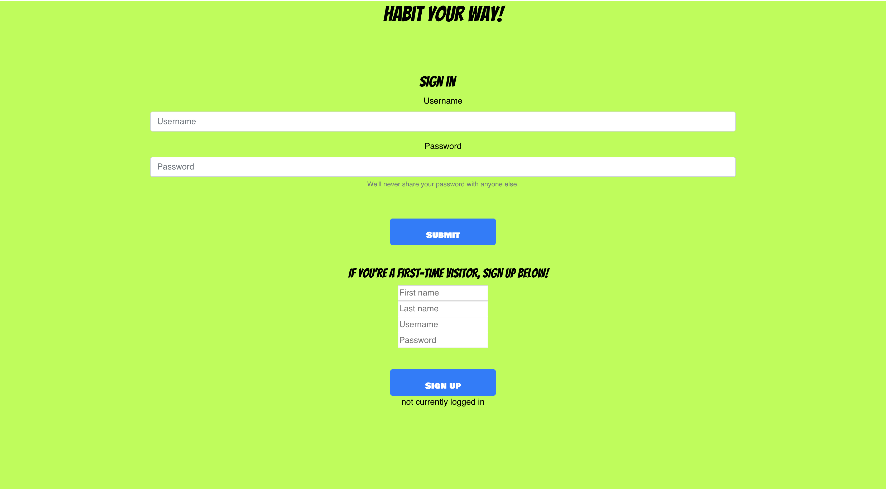

README
======

# BRIEF
Lap 3 : Portfolio Week Project For the rest of the week you will be working to create a habit tracker.

Your website should have the following functionality for users:

- Users should be able to login
- Users should be able to choose a habit they want to track (e.g water, exercise, 8 hours of sleep) and choose the frequency at which they want to track the habit
- Users should be able to track a habit and mark it as complete for the day
- Users should be able to see if they have completed a habit for the day and see if they have a streak of completing their habits

Your website should have the following technical functionality:
        Developers should host a database to store the daily information about users locally.

# User Stories
-       As a user,
        I want to be able to enter username and password to log in,
        Therefore I need a form to put my details in.
-       As a user,
        I want to be able to sign up and have my own account,
        Therefore I need a sign-up form.
-       As a user,
        I want to be able to sign out,
        Therefore I want a sign-out button on my user overview page.
-       As a user,
        I want to be able to add a new task and specify its frequency,
        Therefore I need another form to do this.
-       As a user,
        I want to be able to mark a task as complete,
        Therefore I need a button that sets a task as complete.
-       As a user,
        I want to be able to see my completed vs outstanding tasks for the day,
        Therefore I need a component that displays this info by applying different filters.
-       As a user,
        I want to be able to see how many consecutive times I’ve completed a task,
        Therefore I want my streak to be visible, and incremented each time I complete a task.
-       As a user,
        I want to be greeted when I log in,
        Therefore I want some sort of personalised message to pop up when I log in.

# Setup instructions:
- cd habit_tracker
- npm install 
- cd src/seeds
- node users.seed.js
- node activities.seed.js
- cd ..
- cd ..
- cd backend
- node server.js (This deploys the API so that the react app can query it.)
- cd ..
- (in chrome or browser) install and enable Moesif CORS extension
- npm test (to run tests)
- ctrl c
- npm start (to start application)

# Technologies Used: 
- Node
- Express
- MongoDB
- Jest
- Enzyme
- React
- Git
- Axios
- Async await
- Mongoose

## The website 

  
Sign up page  
  
List of activities page

